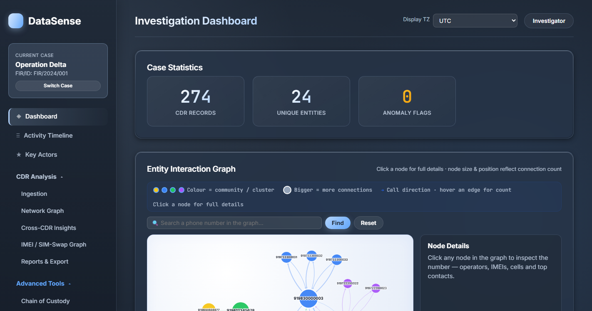
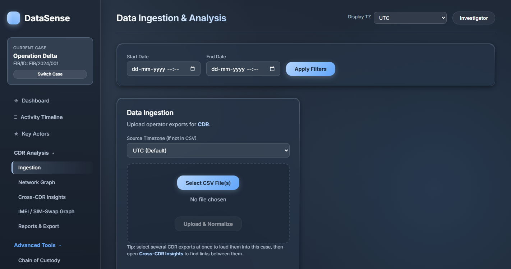
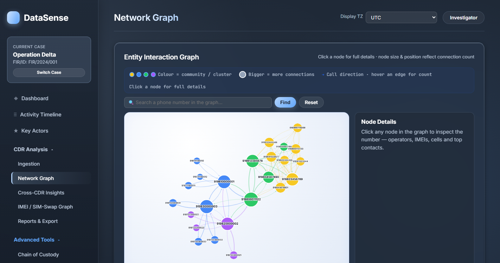
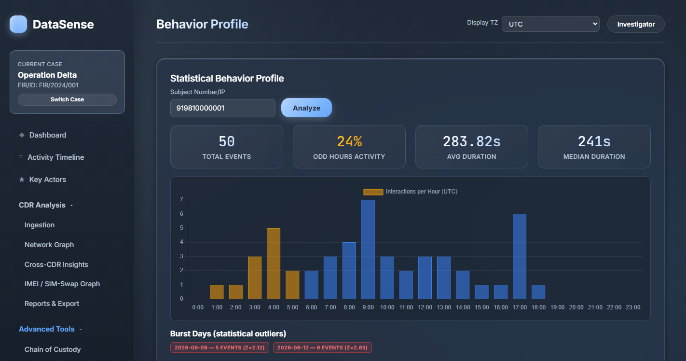
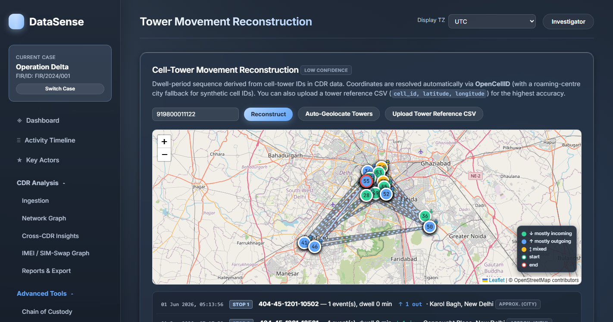
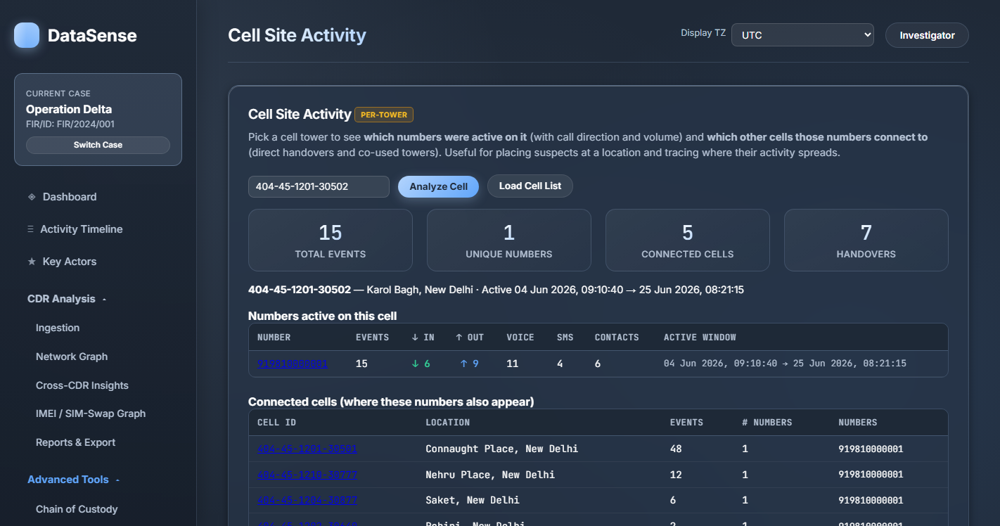
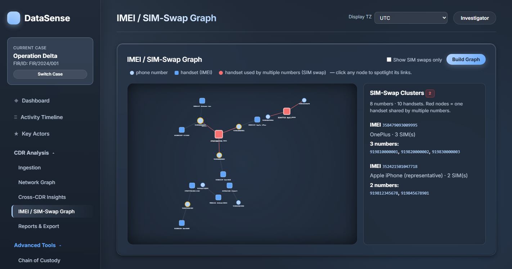
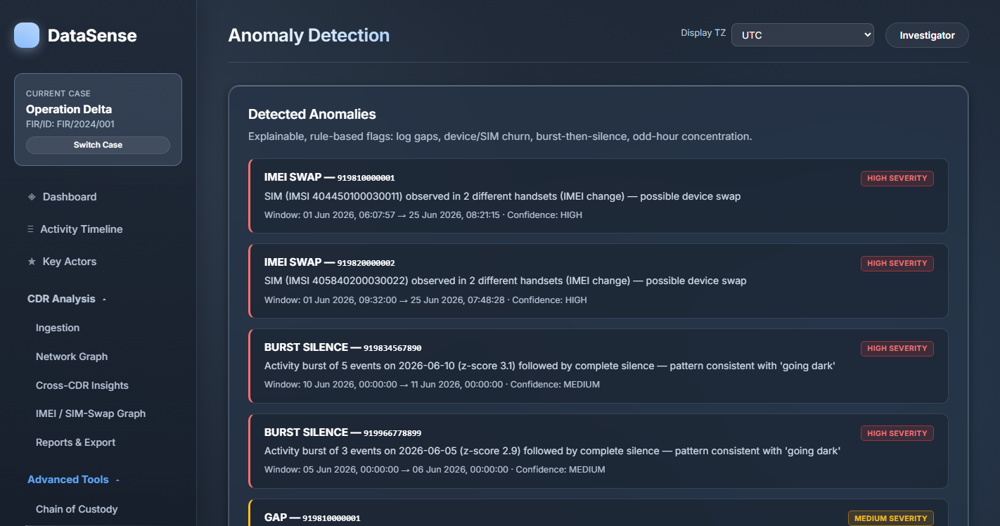

<p align="center">

</p>


# CDR Analysis & Investigation Platform


A **web-based forensic analysis platform for Call Detail Records (CDR)** designed to assist telecom-based criminal investigations. The platform ingests telecom operator CDR exports, normalizes them into a canonical schema, and generates actionable intelligence through network analysis, anomaly detection, tower movement reconstruction, behavioral profiling, and court-oriented forensic reports.

> Developed as an academic/internship project at **Madan Mohan Malaviya University of Technology (MMMUT), Gorakhpur**.

---

# Features

- Case Management (Case/FIR based investigation)
- CDR CSV Upload & Normalization
- SHA-256 Chain of Custody
- Evidence Logging
- Communication Network Graph
- Network Centrality Analysis
- Community Detection
- Rule-Based Anomaly Detection
- Behaviour Profiling
- Cell Tower Movement Reconstruction
- Cell Tower Geolocation
- Cell Site Activity Analysis
- IMEI / SIM Swap Detection
- Cross Analysis
- Unified Timeline
- Court-Oriented Forensic PDF Reports
- CSV Export
- Structured Query Engine

---

# Screenshots

## Dashboard

Complete investigation dashboard showing available analytical modules.



---

## CDR Ingestion

Upload and normalize telecom operator CDR files.



---

## Communication Network Graph

Visualize relationships between mobile numbers using Cytoscape.js.



---

## Subject Behaviour Profile

Analyze communication behaviour, duration, frequency and activity distribution.



---

## Cell Tower Movement

Visualize suspect movement reconstructed from connected cell towers.



---

## Cell Site Activity

Analyze activity observed on individual cell towers.



---

## IMEI / SIM Analysis

Detect handset sharing and SIM swapping using IMEI relationships.



---

## Anomaly Detection

Automatically detect suspicious communication behaviour.



---

# Technology Stack

| Layer | Technologies |
|--------|--------------|
| Backend | FastAPI, SQLAlchemy, SQLite, Pandas, NumPy |
| Analysis | NetworkX |
| Frontend | HTML, CSS, JavaScript |
| Visualization | Cytoscape.js, Chart.js |
| Maps | Leaflet, OpenStreetMap |
| Reporting | ReportLab |
| Hashing | SHA-256 |

---

# Project Structure

```
MMMUT Project/
│
├── backend/
│   ├── api/
│   ├── models/
│   ├── services/
│   │   ├── analysis.py
│   │   ├── enrichment.py
│   │   ├── geolocation.py
│   │   ├── ingestion.py
│   │   └── report.py
│   ├── main.py
│   └── requirements.txt
│
├── frontend/
│   ├── app.js
│   ├── index.html
│   └── styles.css
│
├── sample_data/
│
├── screenshots/
│
└── README.md
```

---

# Workflow

```
Create Investigation Case
            │
            ▼
      Upload CDR CSV
            │
            ▼
 Normalize & Validate Records
            │
            ▼
Generate Investigation Intelligence
            │
 ┌──────────┼────────────┐
 │          │            │
 ▼          ▼            ▼
Network   Behaviour   Movement
 Graph     Profile       Map
 │          │            │
 └──────────┼────────────┘
            │
            ▼
      Anomaly Detection
            │
            ▼
     Generate PDF Report
            │
            ▼
      Court Presentation
```

---

# Quick Start

## Clone Repository

```bash
git clone YOUR_REPO_LINK
cd backend
```

## Create Virtual Environment

```bash
python -m venv venv
```

### Windows

```bash
venv\Scripts\activate
```

### Linux/macOS

```bash
source venv/bin/activate
```

## Install Dependencies

```bash
pip install -r requirements.txt
```

## Run Application

```bash
python main.py
```

Open

```
http://localhost:8001
```

---

# Using the Application

1. Create a new investigation case.
2. Upload a CDR CSV.
3. (Optional) Upload Cell Tower Reference CSV.
4. Explore:
   - Communication Network
   - Behaviour Profile
   - Movement Analysis
   - Cell Activity
   - IMEI Analysis
   - Cross Analysis
5. Generate a customizable forensic PDF report.
6. Export normalized data if required.

---

# REST API Overview

Interactive documentation is available at

```
http://localhost:8001/docs
```

### Case Management

- POST `/cases`
- GET `/cases`
- GET `/cases/{id}`
- DELETE `/cases/{id}`

### Data Ingestion

- POST `/upload/cdr`
- POST `/upload/towers`

### Analysis

- GET `/case/{id}/timeline`
- GET `/case/{id}/graph-metrics`
- GET `/case/{id}/anomalies`
- GET `/case/{id}/subject/{id}/profile`
- GET `/case/{id}/subject/{id}/movement`
- GET `/case/{id}/cells`
- GET `/case/{id}/cell/{id}/activity`
- GET `/case/{id}/cross-analysis`
- GET `/case/{id}/imei-graph`

### Reports

- GET `/report/pdf`
- POST `/report/pdf`

### Export

- GET `/export/csv`

### Evidence

- GET `/case/{id}/custody-log`

---

# Legal Basis

Generated forensic reports include an electronic evidence certificate under:

- **Section 63 — Bharatiya Sakshya Adhiniyam, 2023**

which replaces

- Section 65B, Indian Evidence Act, 1872

The platform maintains evidence integrity using a SHA-256 based chain of custody suitable for digital forensic documentation.

---

# Teammates

- ****
- ****

### Mentor

**Mr. Aman Mishra**
(Research Scholar)

MMMUT, Gorakhpur

### Trainer

**Mr. Naveen Singh**
(Cyint Technologies)

---

# Disclaimer

>This project is developed solely for **academic, educational and authorized forensic investigation purposes**. It is intended to demonstrate digital forensic analysis techniques and should only be used with appropriate legal authorization.
